[English](# dp Architecture Technical Document)

[简体中文](# dp 架构技术文档)

# dp Architecture Technical Document

## Overall Architecture Diagram
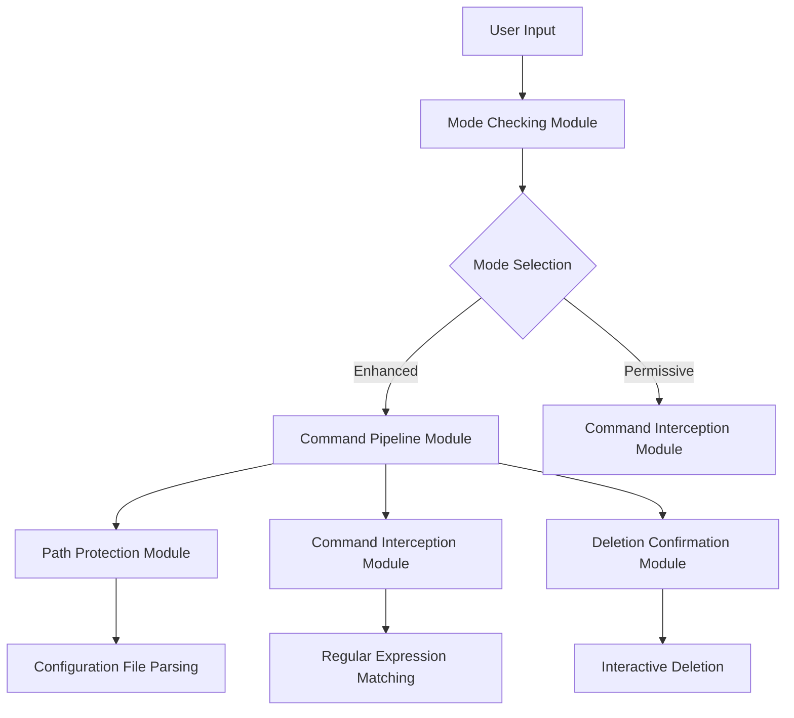

## Core Module Explanation

### 1. Mode Checking Module (check_mode_module)
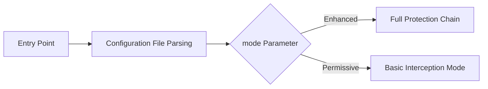

- **Features**:
  - Supports two operation modes:
    - Enhanced: Full protection chain (default strict mode)
    - Permissive: Basic command interception only
  - Case-sensitive strict mode check
  - Automatic termination on configuration errors

### 2. Command Pipeline Module (command_pipeline_module)
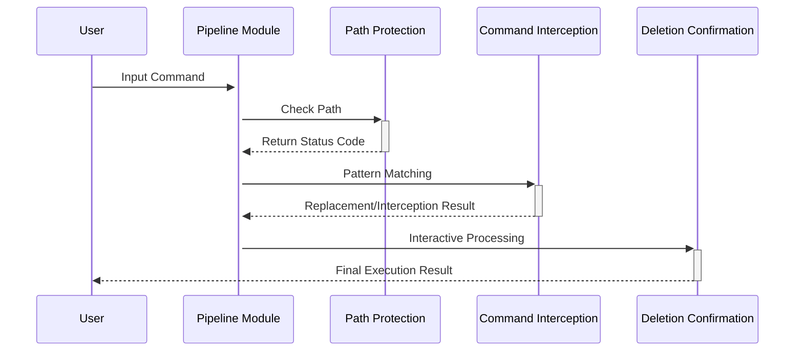

- **Plugin Extension Mechanism**:
  1. Add to configuration file `/etc/deeprotection/deeprotection.conf`:
   ```conf
   #command_intercept_rules
   original_command > replacement_command
   ```
  2. Supported regular expression matching rules:
   - `rm /` → `echo "protected"`
   - `chmod 777 *` → `""` (direct interception)

### 3. Path Protection Module (protected_paths_module)
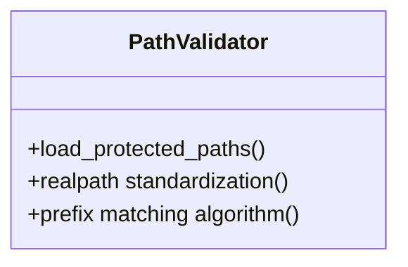

- **Technical Implementation**:
  - Uses `realpath -m` for path standardization
  - Prefix matching algorithm time complexity: O(n)
  - Supports wildcard path configuration:
   ```conf
   #protected_paths_list
   /usr/lib/*
   /etc/passwd
   ```

### 4. Command Interception Module (command_intercept_module)
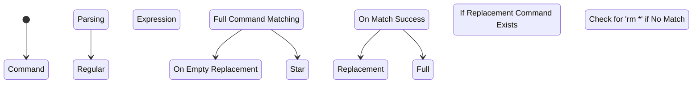

- **Core Algorithm**:
  ```python
  def star_protection(files):
      current_files = os.listdir()
      if sorted(files) == sorted(current_files):
          return "Block 'rm *' operation"
  ```

### 5. Deletion Confirmation Module (rm_replace_module)
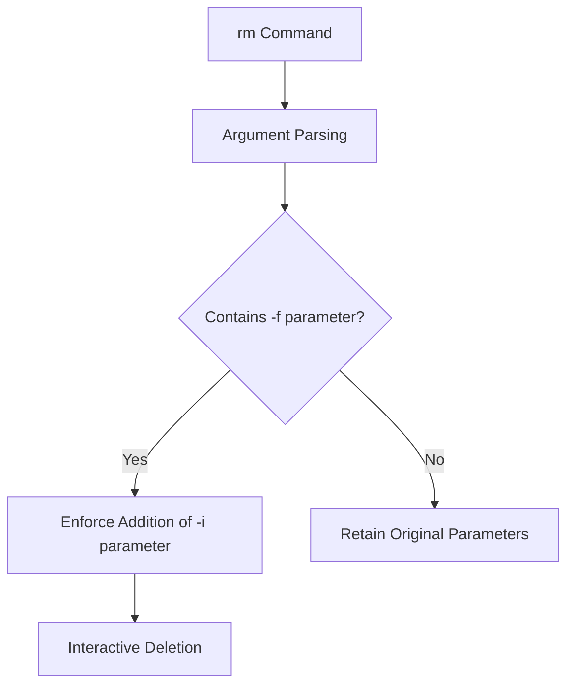

- **Forced Protection Mechanism**:
  - Always add `-i` for interactive confirmation regardless of parameters
  - Output format: `[!] About to execute: /bin/rm -i -v filename`
  - Visual warning: flashing red alert

## Logging System Design
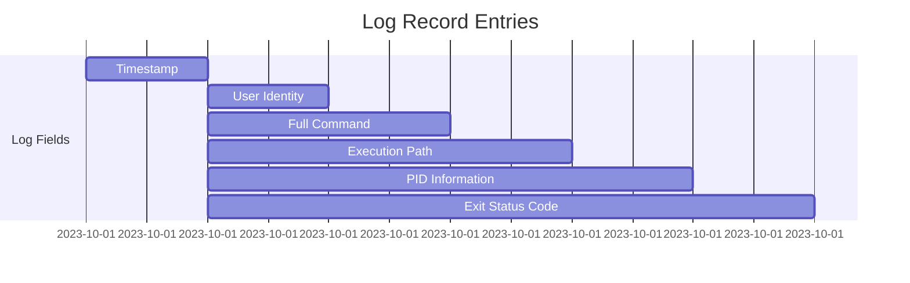

- **Security Design**:
  - Automatic log directory creation (ACL: 700)
  - Log file permissions: `-rw-r-----`
  - Log injection protection: escape special characters

## Configuration File Example
```conf
#deeprotection.conf

#protected_paths_list
/etc/
/root/.ssh
/boot/

#command_intercept_rules
rm -rf /* > 
chmod 777 * > chmod 755
```

## Extension Development Guide

### Plugin Development Interface
```bash
# Custom Plugin Template
_my_plugin() {
    local command="$@"
    # Detection Logic
    if [[ "$command" =~ dangerous_pattern ]]; then
        output_log "[PLUGIN] Blocked Dangerous Command"
        return 1
    fi
    return 0
}

# Insert into Pipeline Module
command_pipeline_module() {
    _my_plugin "$@" || return 1
    protected_paths_module "$@" || return 1
    ...
}
```
---
# dp 架构技术文档

## 整体架构图
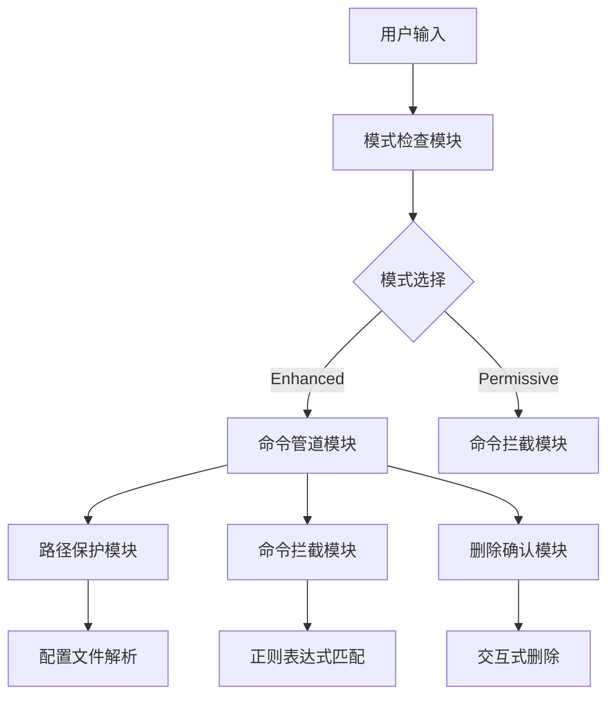

## 核心模块说明

### 1. 模式检查模块 (check_mode_module)
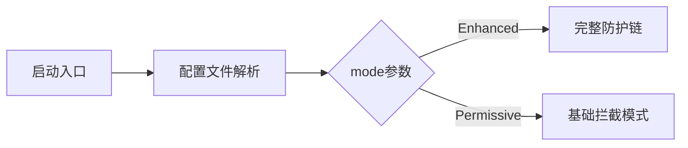

- **功能特性**：
  - 支持两种运行模式：
    - Enhanced：完整防护链（默认严格模式）
    - Permissive：仅基础命令拦截
  - 严格模式检查（区分大小写）
  - 配置错误自动终止

### 2. 命令管道模块 (command_pipeline_module)
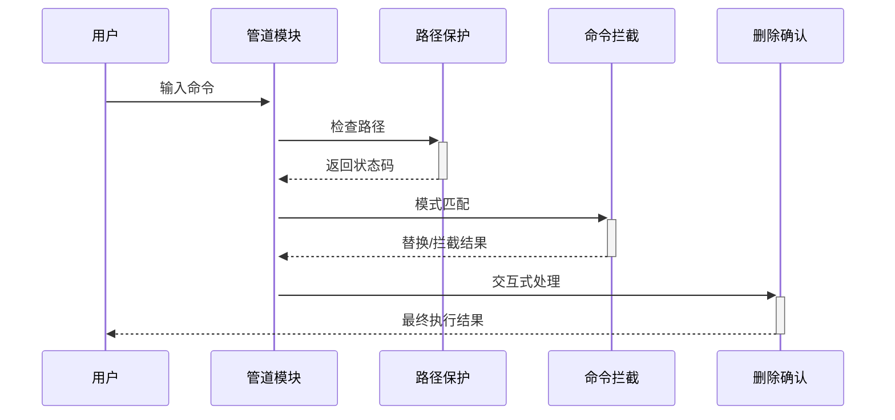

- **插件扩展机制**：
  1. 通过修改配置文件 `/etc/deeprotection/deeprotection.conf` 添加：
   ```conf
   #command_intercept_rules
   original_command > replacement_command
   ```
  2. 支持的正则表达式匹配规则：
   - `rm /` → `echo "protected"`
   - `chmod 777 *` → `""` (直接拦截)

### 3. 路径保护模块 (protected_paths_module)
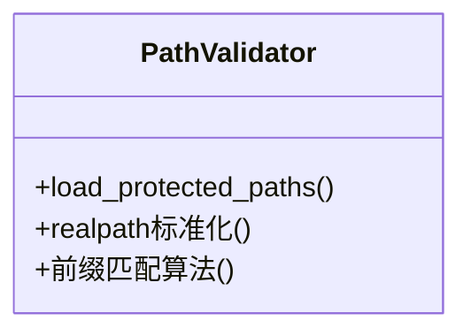

- **技术实现**：
  - 使用 `realpath -m` 进行路径标准化
  - 前缀匹配算法时间复杂度：O(n)
  - 支持通配符路径配置：
   ```conf
   #protected_paths_list
   /usr/lib/*
   /etc/passwd
   ```

### 4. 命令拦截模块 (command_intercept_module)
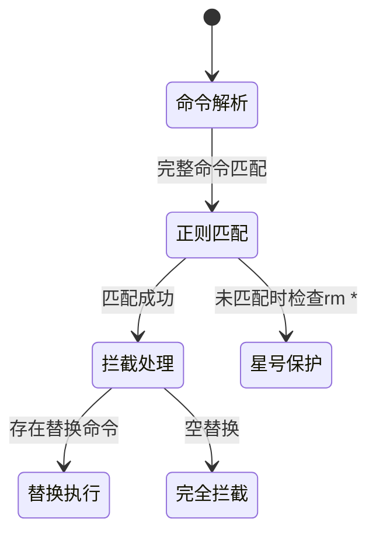

- **核心算法**：
  ```python
  def 星号保护(files):
      current_files = os.listdir()
      if sorted(files) == sorted(current_files):
          return "拦截rm *操作"
  ```

### 5. 删除确认模块 (rm_replace_module)
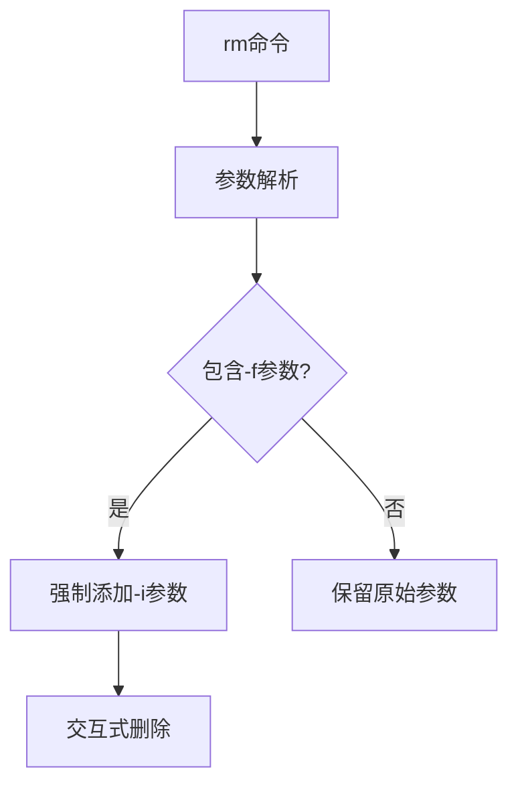

- **强制保护机制**：
  - 无论参数如何都添加 `-i` 交互确认
  - 输出格式：`[!] 即将执行: /bin/rm -i -v filename`
  - 视觉警告：闪烁红色提示

## 日志系统设计


- **安全设计**：
  - 日志目录自动创建 (ACL: 700)
  - 日志文件权限：`-rw-r-----`
  - 日志注入防护：特殊字符转义

## 配置文件示例
```conf
#deeprotection.conf

#protected_paths_list
/etc/
/root/.ssh
/boot/

#command_intercept_rules
rm -rf /* > 
chmod 777 * > chmod 755
```

## 扩展开发指南

### 插件开发接口
```bash
# 自定义插件模板
_my_plugin() {
    local command="$@"
    # 检测逻辑
    if [[ "$command" =~ dangerous_pattern ]]; then
        output_log "[PLUGIN] 拦截危险命令"
        return 1
    fi
    return 0
}

# 插入到管道模块
command_pipeline_module() {
    _my_plugin "$@" || return 1
    protected_paths_module "$@" || return 1
    ...
}
```
