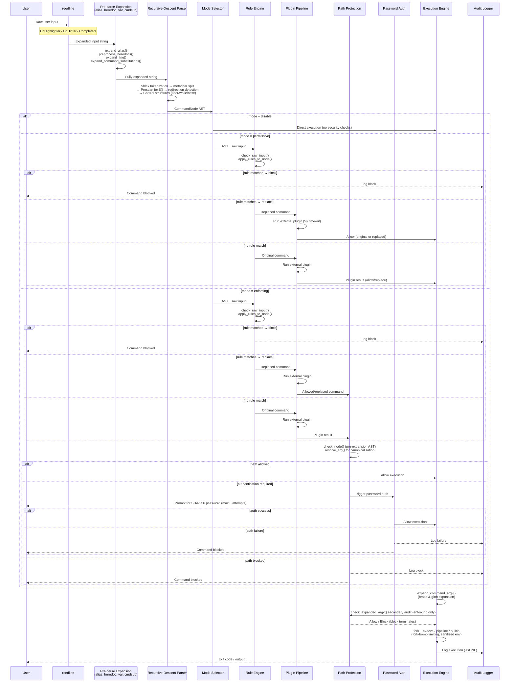

# Deeprotection (dpshell) Architecture Document

## 1. Overview

Deeprotection (`dpshell`) is a fully‑fledged interactive shell with integrated security enforcement, written in Rust. It parses and executes commands natively – no `/bin/sh` wrapper – using a hand-written recursive-descent parser that produces a complete AST with 11 node types. On top of this shell core, it layers rule‑based command matching, plugin extensibility, symlink-aware path protection, JSONL audit logging, and SHA-256 password authentication. The codebase is organized into 10 module groups across 47 source files totalling ~10,883 lines.

## 2. High‑Level Architecture Diagram


```mermaid
sequenceDiagram
    participant User
    participant Reedline as reedline
    participant PreExpand as Pre‑parse Expansion<br/>(alias, heredoc, var, cmdsub)
    participant Parser as Recursive‑Descent Parser
    participant Mode as Mode Selector
    participant RuleEngine as Rule Engine
    participant Plugin as Plugin Pipeline
    participant PathProt as Path Protection
    participant Auth as Password Auth
    participant Executor as Execution Engine
    participant Logger as Audit Logger

    User->>Reedline: Raw user input
    Note over Reedline: DpHighlighter / DpHinter / Completers

    Reedline->>PreExpand: Expanded input string
    PreExpand->>PreExpand: expand_alias()<br/>preprocess_heredocs()<br/>expand_line()<br/>expand_command_substitutions()
    PreExpand->>Parser: Fully expanded string

    Parser->>Parser: Shlex tokenization → metachar split<br/>→ Prescan for $() → redirection detection<br/>→ Control structures (if/for/while/case)
    Parser->>Mode: CommandNode AST

    alt mode = disable
        Mode->>Executor: Direct execution (no security checks)
    else mode = permissive
        Mode->>RuleEngine: AST + raw input
        RuleEngine->>RuleEngine: check_raw_input()<br/>apply_rules_to_node()
        alt rule matches → block
            RuleEngine-->>Logger: Log block
            RuleEngine-->>User: Command blocked
        else rule matches → replace
            RuleEngine->>Plugin: Replaced command
            Plugin->>Plugin: Run external plugin (5s timeout)
            Plugin->>Executor: Allow (original or replaced)
        else no rule match
            RuleEngine->>Plugin: Original command
            Plugin->>Plugin: Run external plugin
            Plugin->>Executor: Plugin result (allow/replace)
        end
    else mode = enforcing
        Mode->>RuleEngine: AST + raw input
        RuleEngine->>RuleEngine: check_raw_input()<br/>apply_rules_to_node()
        alt rule matches → block
            RuleEngine-->>Logger: Log block
            RuleEngine-->>User: Command blocked
        else rule matches → replace
            RuleEngine->>Plugin: Replaced command
            Plugin->>Plugin: Run external plugin
            Plugin->>PathProt: Allowed/replaced command
        else no rule match
            RuleEngine->>Plugin: Original command
            Plugin->>Plugin: Run external plugin
            Plugin->>PathProt: Plugin result
        end

        PathProt->>PathProt: check_node() (pre‑expansion AST)<br/>resolve_arg() for canonicalisation
        alt path allowed
            PathProt->>Executor: Allow execution
        else authentication required
            PathProt->>Auth: Trigger password auth
            Auth->>User: Prompt for SHA‑256 password (max 3 attempts)
            alt auth success
                Auth->>Executor: Allow execution
            else auth failure
                Auth-->>Logger: Log failure
                Auth-->>User: Command blocked
            end
        else path blocked
            PathProt-->>Logger: Log block
            PathProt-->>User: Command blocked
        end
    end

    Executor->>Executor: expand_command_argv()<br/>(brace & glob expansion)
    Executor->>PathProt: check_expanded_argv() secondary audit (enforcing only)
    PathProt-->>Executor: Allow / Block (block terminates)
    Executor->>Executor: fork + execve / pipeline / builtin<br/>(fork‑bomb limiting, sanitised env)
    Executor->>Logger: Log execution (JSONL)
    Executor-->>User: Exit code / output
```

## 3. Module Directory Structure

```
src/
├── main.rs                    # Entry point, REPL loop, script mode, login shell
├── utils.rs                   # Prompt generation, startup animation, user helpers
│
├── parser/                    # Parsing & expansion
│   ├── mod.rs                 # Shlex tokenization, PATH resolution, env sanitization
│   ├── syntax.rs              # Recursive-descent parser, AST node definitions
│   └── expand_vars.rs         # Variable, arithmetic, alias expansion, glob matching
│
├── executor/                  # Command execution
│   ├── mod.rs                 # fork/execve engine, pipelines, function dispatch
│   └── expand.rs              # Brace expansion, glob expansion
│
├── builtins/                  # Built-in commands (27 files)
│   ├── mod.rs                 # Module re-exports, ShellState type alias
│   ├── registry.rs            # Dispatch table: 50+ command registrations
│   ├── basic.rs               # :, history
│   ├── cd.rs                  # cd with interactive ? and ?? modes
│   ├── vars.rs                # export, unset, readonly, local, set
│   ├── echo.rs                # echo (clap-based, ported from brush-builtins)
│   ├── read.rs                # read with multi-variable word splitting
│   ├── printf.rs              # printf format strings
│   ├── pwd.rs                 # pwd (clap-based)
│   ├── test_cmd.rs            # test / [ conditional expressions
│   ├── exec_cmds.rs           # eval, exec, source/.
│   ├── control.rs             # break, continue, shift, trap, wait
│   ├── kill.rs                # kill with signal name/number support
│   ├── dirs.rs                # pushd, popd, dirs, umask
│   ├── alias.rs               # alias, unalias
│   ├── info.rs                # help, type, command -v
│   ├── declare.rs             # declare, typeset, let (with arithmetic eval)
│   ├── simple_cmds.rs         # true, false, exit, return, suspend, times, caller
│   ├── mapfile.rs             # mapfile, readarray
│   ├── getopts.rs             # getopts option parser
│   ├── hash.rs                # hash command table
│   ├── fc.rs                  # fc history editor
│   ├── ulimit.rs              # ulimit resource limits
│   ├── enable_shopt.rs        # enable, shopt
│   ├── complete.rs            # complete, compgen, compopt
│   ├── bind.rs                # bind key bindings
│   └── helpers.rs             # ALL_BUILTINS list, shell_quote, tilde_collapse
│
├── interactive/               # Terminal UI
│   ├── mod.rs                 # Editor builder, FeatureFlags, style constants
│   ├── highlighter.rs         # DpHighlighter: token-level syntax colouring
│   ├── hinter.rs              # DpHinter: fish-style history suggestions
│   ├── smart_completer.rs     # SmartCompleter: fuzzy nucleo-based completion
│   └── bash_completer.rs      # BashCompleter: traditional prefix completion
│
├── security/                  # Security pipeline
│   ├── mod.rs                 # Module re-exports
│   ├── rules.rs               # Rule engine: compile, match, apply (3 matcher types)
│   ├── plugins.rs             # External plugin system with timeout + kill
│   └── protection.rs          # Path protection: symlink-aware, fail-closed
│
├── shell/                     # Shell state
│   └── mod.rs                 # DpShell struct: history, aliases, vars, functions
│
├── config/                    # Configuration
│   └── mod.rs                 # TOML deserialization from /etc/deeprotection/config.toml
│
├── jobs/                      # Job control
│   └── mod.rs                 # JobManager: fg, bg, jobs, process group management
│
└── logging/                   # Audit logging
    └── mod.rs                 # JsonLinesWriter: thread-safe JSONL append to audit.log
```

## 4. Core Data Flow

The complete command processing pipeline from raw user input to execution:


```mermaid
flowchart TD
    %% ── Stage 1: Interactive Input ──────────────────────────────
    User([User Types Input])
    User --> Editor

    subgraph Editor ["1. reedline Editor"]
        direction TB
        HL[DpHighlighter\nSyntax Highlighting]
        HI[DpHinter\nAutosuggestions]
        TC[SmartCompleter / BashModeCompleter\nTab Completion]
        ML[Multi-line Input\nContinuation Detection]
        HD_C[Heredoc Body\nCollection]
    end

    Editor -- "raw input string" --> Expand

    %% ── Stage 2: Pre-parse Expansion ────────────────────────────
    subgraph Expand ["2. Pre-parse Expansion Pipeline"]
        direction TB
        EA["a) expand_alias()\nAlias Substitution"]
        EB["b) preprocess_heredocs()\n≪DELIM → &lt;tempfile"]
        EC["c) expand_line()\n$VAR, ${VAR:-def}, $((…))\n\\$ → U+FFFD sentinel\n$(cmd) preserved"]
        ED["d) expand_command_substitutions()\nfork / pipe / waitpid\nNested $() via prescan"]
        EA --> EB --> EC --> ED
    end

    Expand -- "fully expanded string" --> Parser

    %% ── Stage 3: Parser ─────────────────────────────────────────
    subgraph Parser ["3. Recursive-Descent Parser — syntax.rs"]
        direction TB
        P1[Shlex Tokenization\nwith split_respecting_dollar_paren]
        P2["Metachar Split: | && || ; &"]
        P3["Prescan for $(…)\nPreserving Nested Parens / Quotes"]
        P4["I/O Redirection Detection\n9 Types with FD Tracking"]
        P5["Control Structures\nif / for / while / until / case / function"]
        P1 --> P2 --> P3 --> P4 --> P5

        subgraph AST_Types ["CommandNode AST — 11 Node Types"]
            direction LR
            N1[Simple]
            N2[Pipeline]
            N3[Logical]
            N4[Background]
            N5[Compound]
            N6[FunctionDef]
            N7[If]
            N8[For]
            N9[While]
            N10[Until]
            N11[Case]
        end
        P5 --> AST_Types
    end

    Parser -- "CommandNode AST" --> Builtin

    %% ── Stage 4: Built-in Dispatch ──────────────────────────────
    subgraph Builtin ["4. Built-in Dispatch — main.rs"]
        direction TB
        B1["Special-case Builtins\ncd, exit, fg, bg, jobs,\nsource, eval, exec,\ncommand, builtin, return"]
        B2["Assignment Detection\nVAR=value → shell_vars"]
        B3["Registry Lookup\n50+ Commands via Dispatch Table"]
        B4["Function Definitions\nStore AST Body in Function Table"]
    end

    Builtin -- "matched:\nexecute in-process" --> PostExec
    Builtin -- "not a builtin" --> Security

    %% ── Stage 5: Security Pipeline ──────────────────────────────
    subgraph Security ["5. Security Pipeline — mode-dependent"]
        direction TB

        subgraph S5a ["5a. Raw-Input Rule Check — check_raw_input()"]
            SA1["Regex on Full Input\n+ Tail Substrings after && || ;"]
            SA2["Catches Fork Bombs\nEven After Compound Operators"]
        end

        subgraph S5b ["5b. AST-Level Rules — apply_rules_to_node()"]
            SB1["Walk Full AST Tree Recursively"]
            SB2["Test Each SimpleCommand Leaf\nRawRegex / CommandName / AnyArg"]
            SB3["First Match Wins\nBlock or Replace → Re-parse"]
        end

        subgraph S5c ["5c. Plugin Pipeline — run_plugins()"]
            SC1["Synchronous Sequential Invocation"]
            SC2["stdin + DPSHELL_COMMAND Env Var"]
            SC3["Exit: 0=Allow  1=Block  2=Replace"]
            SC4["5s Timeout → SIGKILL + Zombie Reap"]
        end

        subgraph S5d ["5d. Path Protection — enforcing only"]
            SD1["check_node()\nPre-expansion AST Walk"]
            SD2["check_expanded_argv()\nPost-glob Concrete Paths"]
            SD3["resolve_arg()\nCanonicalise Longest Ancestor\nCatch ../ + Symlinks"]
            SD4["--option=VALUE + key=value\nInspection"]
        end

        S5a --> S5b --> S5c --> S5d
    end

    Security -- "Blocked" --> Blocked
    Security -- "RequiresAuth" --> Auth
    Security -- "Allowed" --> Executor

    Blocked["🔴 Block & Log\nWARN → audit.log"]
    Auth{"SHA-256\nPassword Auth\n3 Attempts"}
    Auth -- "success" --> Executor
    Auth -- "failure" --> Blocked

    %% ── Stage 6: Executor ───────────────────────────────────────
    subgraph Executor ["6. Executor — executor/mod.rs"]
        direction TB

        subgraph Exp6a ["6a. expand_command_argv()"]
            E1["Brace Expansion\n{a,b,c}, {1..5}"]
            E2["Glob Expansion\n*.log, file?.txt"]
            E3["Checked Arithmetic\n65 536 Arg Cap"]
            E4["Runs in PARENT\nSecurity Sees Real Paths"]
        end

        E5["6b. Post-expansion Path Audit\ncheck_expanded_argv()"]

        subgraph Exec6c ["6c. Execution Dispatch"]
            direction LR
            D1["Simple → fork + execve\n(sanitised env)"]
            D2["Pipeline → N forks\npipe(2) fd plumbing\nIn-process builtins"]
            D3["Logical → exit-code\nAnd / Or"]
            D4["Background → fork\nnew process group"]
            D5["If/For/While/Until/Case\n→ recursive execute_node"]
            D6["Function Call →\nnew ExecContext\npositional params"]
        end

        subgraph Limits ["6d. Fork-Bomb Rate Limiter"]
            L1["64 forks / second"]
            L2["256 concurrent children"]
            L3["128 call depth"]
        end

        subgraph Redir ["6e. I/O Redirection"]
            R1["9 redirect types\nvia libc::dup2"]
            R2["fd save / restore\nfor while/until stdin"]
            R3["stdout flush before\nprocess::exit"]
        end

        Exp6a --> E5 --> Exec6c
    end

    Executor -- "exit code" --> PostExec

    %% ── Stage 7: Post-Execution ─────────────────────────────────
    subgraph PostExec ["7. Post-Execution"]
        direction TB
        PE1["JobManager Update\nfg / bg / stopped / done"]
        PE2["Audit Log Entry\nJsonLinesWriter → /var/log/audit.log"]
        PE3["$? last_exit Updated"]
        PE4["Background Job Polling\nBefore Next Prompt"]
        PE5["Dynamic Config Reload\nContent-based Check"]
    end

    PostExec -- "next prompt" --> User

    %% ── Styling ─────────────────────────────────────────────────
    classDef stageHead fill:#2d6a4f,stroke:#1b4332,color:#fff
    classDef security fill:#9d0208,stroke:#6a040f,color:#fff
    classDef blocked  fill:#d00000,stroke:#6a040f,color:#fff
    classDef auth     fill:#e85d04,stroke:#dc2f02,color:#fff
    classDef exec     fill:#005f73,stroke:#003049,color:#fff
    classDef post     fill:#3a506b,stroke:#1c2541,color:#fff

    class Editor,Expand,Parser stageHead
    class Security security
    class Blocked blocked
    class Auth auth
    class Executor exec
    class PostExec post
```

## 5. Core Data Structures

### 5.1 CommandNode (AST)

```rust
pub enum CommandNode {
    Simple(SimpleCommand),
    Pipeline(Vec<SimpleCommand>),
    Logical { left: Box<CommandNode>, op: LogicOp, right: Box<CommandNode> },
    Background(Box<CommandNode>),
    Compound(Vec<CommandNode>),
    FunctionDef { name: String, body: Box<CommandNode> },
    If { cond: Box<CommandNode>, then_body: Vec<CommandNode>,
         elifs: Vec<(CommandNode, Vec<CommandNode>)>, else_body: Vec<CommandNode> },
    For { var: String, words: Vec<String>, body: Vec<CommandNode> },
    While { cond: Box<CommandNode>, body: Vec<CommandNode>, redirections: Vec<Redirection> },
    Until { cond: Box<CommandNode>, body: Vec<CommandNode>, redirections: Vec<Redirection> },
    Case { word: String, arms: Vec<(Vec<String>, Vec<CommandNode>)> },
}
```

### 5.2 SimpleCommand

```rust
pub struct SimpleCommand {
    pub program: String,          // Resolved binary path or builtin name
    pub argv: Vec<String>,        // Full argument vector including argv[0]
    pub is_builtin: bool,
    pub raw: String,              // Original user input (for logging/display)
    pub redirections: Vec<Redirection>,
}
```

### 5.3 ExecContext

```rust
pub struct ExecContext<'a> {
    pub protected_paths: &'a [String],
    pub allowlist: &'a [String],
    pub password_hash: &'a str,
    pub enforce: bool,
    pub functions: &'a RefCell<HashMap<String, CommandNode>>,
    pub call_depth: u32,
    pub shell_vars: &'a HashMap<String, String>,
    pub last_exit: i32,
    pub positional_params: &'a [String],
}
```

### 5.4 DpShell (Shell State)

```rust
pub struct DpShell {
    pub history: Vec<String>,
    pub aliases: HashMap<String, String>,
    pub readonly_vars: HashSet<String>,
    pub dir_stack: Vec<PathBuf>,
    pub traps: HashMap<String, String>,
    pub shell_vars: HashMap<String, String>,
    pub functions: RefCell<HashMap<String, CommandNode>>,
}
```

### 5.5 CompiledRule (Security)

```rust
pub struct CompiledRule {
    pub name: String,
    pub matcher: RuleMatcher,    // RawRegex(Regex) | CommandName(String) | AnyArg(Regex)
    pub action: RuleAction,      // Block | Replace(String)
}
```

### 5.6 Job (Job Control)

```rust
pub struct Job {
    pub id: usize,
    pub pgid: Pid,
    pub command: String,
    pub status: JobStatus,       // Foreground | Background | Stopped | Done(i32)
}
```

## 6. Integration with External Projects

### 6.1 brush-shell Reference

dpshell's parser logic, executor framework, and several built-in command implementations were informed by the [brush-shell](https://github.com/reubeno/brush) project. Specifically:

- **Parser architecture**: The recursive-descent approach and AST node design follow patterns established in brush-parser, adapted for dpshell's security-first requirements (accepting unresolved commands at parse time for runtime function dispatch).
- **Built-in commands**: `echo`, `read`, `printf`, `pwd` and other builtins were ported from brush-builtins, adapted from brush's async executor context to dpshell's synchronous `DpShell` state model. Some use clap for argument parsing (matching brush's approach).
- **Executor patterns**: The fork/execve pipeline execution model and variable expansion architecture draw on brush-core's design, simplified for dpshell's single-threaded, security-audited execution model.

The original brush source is retained under `vendor/brush/` as reference material.

### 6.2 reedline Integration

The interactive experience is built entirely on [reedline](https://github.com/nushell/reedline) (v0.35):

- **DpHighlighter** implements `reedline::Highlighter` — performs character-level lexing to classify tokens (Command, Builtin, Argument, Flag, String, Operator, Comment, Unknown) and applies `nu-ansi-term` styling.
- **DpHinter** implements `reedline::Hinter` — provides fish-style ghost-text suggestions from command history.
- **SmartCompleter** implements `reedline::Completer` — uses `nucleo` fuzzy matching for file and command completion with a `ColumnarMenu` for columnar display.
- **BashModeCompleter** implements `reedline::Completer` — traditional prefix-based completion via `BashCompleter`.
- **FeatureFlags** control which components are wired into the editor at startup and on dynamic config reload.

### 6.3 crossterm Patch

A local patch of crossterm 0.28.1 is maintained at `patches/crossterm-0.28.1/` to suppress compilation warnings:
- `#[allow(dead_code)]` on `InternalEventFilter` (used only in test code)
- `[lints.rust]` table with `check-cfg` entries for Windows-only `cfg` guards

## 7. Security Architecture

### 7.1 Three-Layer Audit

```
Layer 1: Raw Input          ─── check_raw_input()
         Regex on full string + tail substrings after &&/||/;
         Catches structural patterns (fork bombs) before parsing

Layer 2: AST Rules          ─── apply_rules_to_node()
         Walks entire AST tree, tests each SimpleCommand leaf
         Three matcher types: RawRegex, CommandName, AnyArg
         First-match-wins, actions: Block or Replace

Layer 3: Path Protection    ─── check_node() + check_expanded_argv()
         Pre-fork: walks unexpanded AST arguments
         Post-expansion: checks glob-expanded concrete paths
         Symlink-aware canonicalization via resolve_arg()
         Fail-closed on cwd unavailability
```

### 7.2 Anti-Bypass Measures

- **Path traversal**: `resolve_arg()` canonicalizes the longest existing ancestor, catching `../` traversal and symlink redirects to protected directories.
- **Compound operator embedding**: `check_raw_input()` scans tail substrings after `&&`, `||`, `;` so fork bombs embedded after legitimate commands are caught.
- **Option-value inspection**: `extract_path_arg()` parses `--option=VALUE` and bare `key=value` (dd-style) forms to find hidden path arguments.
- **Plugin output sanitization**: `sanitize_replacement()` strips newlines and NUL bytes from plugin stdout to prevent command injection via crafted replacement strings.
- **Environment sanitization**: `sanitised_env()` removes 11 dangerous variables (`LD_PRELOAD`, `LD_LIBRARY_PATH`, `PYTHONPATH`, `IFS`, etc.) from all child process environments.
- **Fork-bomb rate limiting**: Thread-local counters enforce 64 forks/s, 256 concurrent children, and 128 call depth.

## 8. Configuration Architecture

**Path**: `/etc/deeprotection/config.toml` (hardcoded in `config/mod.rs`)

```rust
pub struct Config {
    pub core: CoreConfig,        // mode, bash_compat, dynamic_config
    pub auth: AuthConfig,        // password_hash
    pub paths: PathsConfig,      // protect[], allowlist[]
    pub rules: Vec<Rule>,        // [[rules]] array
    pub features: FeaturesConfig, // syntax_highlighting, auto_suggest, enhance_completion
}
```

**Dynamic Reload Mechanism**: In the REPL loop, before processing each command, `main.rs` reads the config file and compares its content (as a string) against the last known content. If changed, it deserializes the new config, updates all mutable state (mode, rules, paths, etc.), and rebuilds the reedline editor if feature flags changed. This approach is race-free (no background thread) and has negligible I/O cost for small config files.

## 9. Script Execution Architecture

### 9.1 Multi-line Block Joining

Script mode reads all lines from the script file, then joins them into complete logical units using `has_unclosed_block()`:

```
Input lines:          Logical units after joining:
  if [ $x -eq 1 ]      "if [ $x -eq 1 ]\nthen\necho yes\nfi"
  then                  "for i in 1 2 3\ndo\necho $i\ndone"
  echo yes
  fi
  for i in 1 2 3
  do
  echo $i
  done
```

`has_unclosed_block()` tracks `if/fi`, `for/while/until/done`, `case/esac`, and `{/}` depth with quote-aware scanning.

### 9.2 Heredoc Preprocessing

`preprocess_heredocs()` runs before parsing and handles `<<DELIM` / `<<-DELIM` patterns:
1. Scans for heredoc operators outside quotes
2. Extracts the body (lines between operator and delimiter)
3. Writes body to a temp file (`/tmp/dpshell_hd_<pid>_<delim>`)
4. Replaces the heredoc syntax with `<tempfile` redirect
5. Handles multiple heredocs in one input, processed in reverse order to preserve byte offsets

### 9.3 Login Shell Behaviour

When invoked as a login shell (`-l`, `--login`, or leading `-` in argv[0]), dpshell sets the `is_login` flag but does **not** source `/etc/profile`, `~/.bash_profile`, or `~/.profile`. Profile sourcing was intentionally removed to avoid errors from non-POSIX constructs in system profiles when dpshell is used as a login shell (e.g. via SSH on appliance systems).

## 10. Extension Points & Customisation Guide

### 10.1 Adding a New Rule
Edit the `[[rules]]` table in `/etc/deeprotection/config.toml` – no code changes required. With `dynamic_config = true`, rules take effect on the next command.

### 10.2 Adding a New Plugin
Create a directory with `plugin.json` and an entrypoint script in `/etc/deeprotection/plugins/`.

### 10.3 Modifying Protected Paths or Allowlist
Edit the `[paths]` section; with dynamic config enabled, changes take effect immediately.

### 10.4 Adding a New Built-in Command
1. Create a new file `src/builtins/mycommand.rs` with a function signature `pub fn builtin_mycommand(args: &[String], state: &mut DpShell) -> i32`.
2. Add the module to `src/builtins/mod.rs`.
3. Register the command in `src/builtins/registry.rs` via `default_builtins()`.
4. If the command needs special handling (re-entry, job control, etc.), add a match arm in the REPL dispatch block in `main.rs`.

### 10.5 Customising Interactive Features
Toggle `[features]` flags in config, or replace the highlighter/completer implementations in `src/interactive/`.

## 11. Dependencies (from Cargo.toml)

```toml
[dependencies]
chrono = "0.4"              # Timestamp generation
rustyline = "14"            # Legacy (retained, reedline is primary)
regex = "1.10"              # Rule pattern matching
anyhow = "1.0"              # Error handling
serde = { version = "1.0", features = ["derive"] }
serde_json = "1.0"          # JSONL audit log
toml = "0.8"                # Configuration parsing
ctrlc = "3"                 # Ctrl+C handler
users = "0.11"              # OS username lookup
fluent = "0.16"             # i18n (reserved for future localization)
fluent-bundle = "0.15"
unic-langid = { version = "0.9", features = ["macros"] }
intl-memoizer = "0.5"
walkdir = "2.4"             # Recursive directory traversal (cd ??)
terminal_size = "0.3"       # Terminal width detection
sha2 = "0.10"               # Password hash verification
rpassword = "7"             # Secure password input
libc = "0.2"                # Low-level Unix API (dup2, tcsetpgrp)
shlex = "1"                 # Shell tokenization
nix = { version = "0.29", features = ["process", "signal"] }
glob = "0.3"                # Filename globbing
reedline = "0.35"           # Line editor (highlighting, hints, menus)
nucleo = "0.5"              # Fuzzy matching for completion
nu-ansi-term = "0.50"       # ANSI terminal styling
clap = { version = "4.6", features = ["derive", "wrap_help"] }
thiserror = "2.0"           # Custom error types
itertools = "0.14"          # Iterator utilities

[patch.crates-io]
crossterm = { path = "patches/crossterm-0.28.1" }  # Warning suppression patch
```

---

*Document Version: 3.0*
*Last Updated: 2026‑05‑17*
*For Deeprotection (dpshell) v3.0.0*