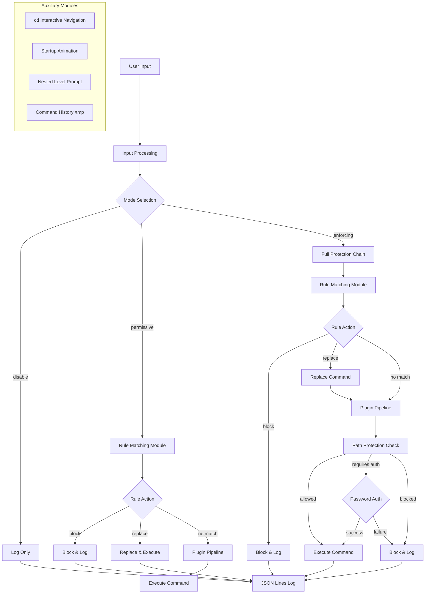
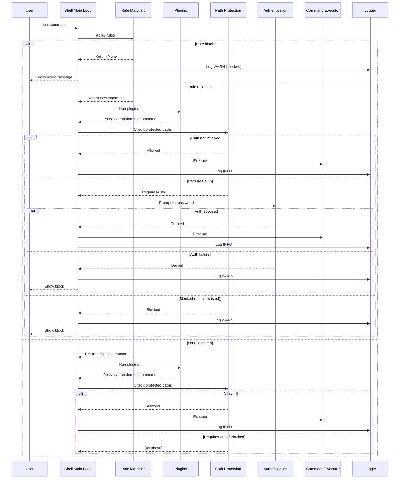

# Deeprotection (Shell Wrapper) Architecture Document

## 1. Overview

Deeprotection (Shell Wrapper) is a command-line security wrapper that provides command interception, rule-based matching, plugin extensibility, path protection, audit logging, and password authentication. The refactored architecture emphasizes modularity, configuration-driven behavior, and a clear separation of concerns while retaining distinctive interactive features (interactive `cd` navigation, nested level prompt, startup animation).

## 2. High-Level Architecture Diagram


```mermaid
graph TD
    A[User Input] --> B[Input Processing]
    B --> C{Mode Selection}
    C -->|disable| D[Log Only]
    C -->|permissive| E[Rule Matching Module]
    C -->|enforcing| F[Full Protection Chain]

    E --> G{Rule Action}
    G -->|block| H[Block & Log]
    G -->|replace| I[Replace & Execute]
    G -->|no match| J[Plugin Pipeline]
    J --> K[Execute Command]

    F --> L[Rule Matching Module]
    L --> M{Rule Action}
    M -->|block| N[Block & Log]
    M -->|replace| O[Replace Command]
    O --> P[Plugin Pipeline]
    M -->|no match| P
    P --> Q[Path Protection Check]
    Q -->|allowed| R[Execute Command]
    Q -->|requires auth| S{Password Auth}
    S -->|success| R
    S -->|failure| T[Block & Log]
    Q -->|blocked| T

    D --> U[JSON Lines Log]
    H --> U
    I --> U
    N --> U
    R --> U
    T --> U

    subgraph Auxiliary Modules
        V[cd Interactive Navigation]
        W[Startup Animation]
        X[Nested Level Prompt]
        Y[Command History /tmp]
    end
```

## 3. Core Module Descriptions

### 3.1 Mode Selection & Dispatching

- **Responsibility**: Determine the command processing flow based on `core.mode` in the configuration file.
- **Three Modes**:
  - `disable`: Execute unconditionally; log only (no rules, plugins, or path protection).
  - `permissive`: Apply rules, then run plugins; **no path protection**.
  - `enforcing`: Full chain: rule matching → plugins → path protection (with password authentication when required).
- **Implementation**: Mode branching in the main loop (`main.rs`).

### 3.2 Rule Matching Module

- **Configuration Source**: `[[rules]]` TOML array in `/etc/deeprotection/config.toml`.
- **Rule Compilation**: Each rule is compiled into a `CompiledRule` at startup, containing a regex pattern and an action (block or replace). Disabled rules are skipped.
- **Matching Flow**: Rules are evaluated in the order they appear; **first match wins**.
- **Pattern Types**:
  - **Plain string**: Automatically converted to an anchored regex that allows flexible whitespace (e.g., `"rm -rf"` becomes `^\s*rm\s+-rf\s*$`).
  - **Explicit regex**: Prefixed with `re:` (e.g., `"re:^echo 111$"`).
- **Rule Example**:
  ```toml
  [[rules]]
  name = "block_rm_rf"
  pattern = "rm -rf"
  action = { block = true }
  enabled = true
  
  [[rules]]
  name = "replace_echo"
  pattern = "re:^echo 111$"
  action = { replace = "echo 222" }
  enabled = true
  ```

### 3.3 Path Protection Module (Enforcing Mode Only)

- **Responsibility**: In `enforcing` mode, after rules and plugins have produced a final command, determine if that command operates on a protected path and whether authentication or blocking is required.
- **Configuration Keys**:
  - `[paths] protect`: List of absolute directory prefixes considered protected.
  - `[paths] allowlist`: List of command basenames (e.g., `"rm"`, `"cat"`) that are permitted to operate on protected paths, subject to authentication.
- **Detection Logic**:
  1. Parse the command line into tokens; the command basename is extracted (e.g., `/bin/rm` → `rm`).
  2. Identify explicit path arguments (non‑flag tokens) and resolve them to absolute paths.
  3. If any explicit argument starts with a protected prefix, a protected path is involved.
  4. If no explicit path argument exists but the current working directory itself is under a protected prefix, the command implicitly operates on a protected path (e.g., `ls`, `touch newfile` inside `/root`).
- **Policy Decision**:
  - If no protected path is touched → `Allowed` (execute normally).
  - If a protected path **is** touched:
    - Command is in `allowlist` → `RequiresAuth` (prompt for password; execute on success).
    - Command is NOT in `allowlist` → `Blocked` (reject immediately).
    - If `allowlist` is empty → `Blocked` (secure default).
- **Authentication**: Password prompt (up to 3 attempts) using SHA‑256 verification against `[auth].password_hash`.

### 3.4 Plugin System

- **Directory**: `/etc/deeprotection/plugins/`
- **Plugin Structure**: Each plugin resides in its own subdirectory named after its ID:
  ```
  /etc/deeprotection/plugins/
    example-plugin/
      plugin.json
      entrypoint_script
  ```
- **`plugin.json` Format**:
  ```json
  {
    "id": "example-plugin",
    "name": "Example Plugin",
    "version": "1.0.0",
    "author": "Jane Doe",
    "description": "Description of what the plugin does.",
    "enabled": true,
    "entrypoint": "entrypoint_script"
  }
  ```
  - `entrypoint` may be an absolute path or relative to the plugin directory.
- **Invocation Model**:
  - The command string is passed to the plugin via **stdin** and the environment variable `DPSHELL_COMMAND`.
  - The plugin must exit with a specific code:
    - `0` → allow the command (stdout ignored).
    - `1` → block the command.
    - `2` → replace the command; stdout must contain the new command string.
  - Any other exit code, timeout (>5 seconds), or spawn failure results in **fail‑open** (allow original command, warn to stderr).
- **Execution Order**: Plugins are run **synchronously** in the order they were discovered (directory scan order). The command may be transformed by each plugin in sequence.

### 3.5 Logging Module

- **Format**: JSON Lines (one JSON object per line).
- **Log File**: `/var/log/audit.log` (auto‑created with append mode).
- **Field Definitions**:

| Field         | Type   | Description                                 |
| ------------- | ------ | ------------------------------------------- |
| `timestamp`   | string | ISO 8601 UTC (second precision)             |
| `level`       | string | INFO / WARN                                 |
| `user`        | string | Username who executed the command           |
| `mode`        | string | disable / permissive / enforcing            |
| `command`     | string | Original user input command                 |
| `working_dir` | string | Current working directory at execution time |
| `pid`         | u32    | Process ID                                  |
| `exit_code`   | i32    | Exit code (reserved, currently 0)           |
| `message`     | string | Additional info (e.g., "blocked by rule")   |

- **Thread Safety**: A `Mutex<LineWriter<File>>` ensures writes are safe from a single-threaded main loop.
- **Flushing**: `flush()` is called after each command to guarantee entries are written to disk.

### 3.6 Interactive `cd` Navigation

- **Command Forms**:
  - `cd ?`  → List non‑hidden subdirectories in the current directory; user selects by number, `q` to quit.
  - `cd ??` → Recursive directory browser; displays subdirectories level‑by‑level; `l` to go up, `q` to quit.
- **Implementation**: Handled entirely within the `cd` module; all messages are hardcoded in English (i18n removed per architectural simplification).

### 3.7 Auxiliary Features

- **Startup Animation**: The string `"dpshell>"` slides from left to right across the terminal using ANSI cursor control.
- **Nested Level Prompt**: Environment variable `DPSHELL_LEVEL` tracks nesting depth; prompt displays as `dpshell(level)$ ` (or `#` for root).
- **Command History**: Stored in `/tmp/dpshell_history.<random hex>`; file is deleted on clean exit. The random suffix reduces the risk of collision across concurrent sessions.

## 4. Configuration File Format (TOML)

**Path**: `/etc/deeprotection/config.toml`

```toml
[core]
mode = "enforcing"      # disable / permissive / enforcing

[auth]
# SHA-256 hex digest of admin password (generate with: echo -n "pass" | sha256sum)
password_hash = "31fc7f00f4a0f72653d3ba5f445b8c21d922ae786da3f0a3a780f573942d00aa"

[paths]
protect = ["/root/test", "/root/.ssh"]
allowlist = ["rm", "rmdir", "mv", "cp", "chmod", "chown", "touch", "cat", "ls"]

[[rules]]
  id = "bf76f496a137"
  name = "block_echo"
  pattern = "echo"
  enabled = false
  [rules.action]
    block = true

[[rules]]
  id = "bf76f4963416"
  name = "replace_echo_111"
  pattern = "echo 111"
  enabled = true
  [rules.action]
    replace = "echo 222"
```

- **Notes**:
  - The `language` key is **not** supported; all UI messages are in English.
  - An empty `allowlist` means **no** command may operate on a protected path (blocked immediately).

## 5. Log Output Example

```json
{"timestamp":"2025-04-13T10:30:22Z","level":"WARN","user":"alice","mode":"enforcing","command":"rm /etc/passwd","working_dir":"/home/alice","pid":1234,"exit_code":0,"message":"blocked: command not in allowlist (final: rm /etc/passwd)"}
{"timestamp":"2025-04-13T10:32:05Z","level":"INFO","user":"alice","mode":"permissive","command":"echo 111","working_dir":"/home/alice","pid":1235,"exit_code":0,"message":"replaced to: echo 222"}
```

## 6. Core Flow Sequence Diagram (Enforcing Mode)


```mermaid
sequenceDiagram
    participant U as User
    participant S as Shell Main Loop
    participant R as Rule Matching
    participant P as Plugins
    participant PP as Path Protection
    participant A as Authentication
    participant E as Command Executor
    participant L as Logger

    U->>S: Input command
    S->>R: Apply rules
    alt Rule blocks
        R-->>S: Return None
        S->>L: Log WARN (blocked)
        S-->>U: Show block message
    else Rule replaces
        R-->>S: Return new command
        S->>P: Run plugins
        P-->>S: Possibly transformed command
        S->>PP: Check protected paths
        alt Path not involved
            PP-->>S: Allowed
            S->>E: Execute
            S->>L: Log INFO
        else Requires auth
            PP-->>S: RequiresAuth
            S->>A: Prompt for password
            alt Auth success
                A-->>S: Granted
                S->>E: Execute
                S->>L: Log INFO
            else Auth failure
                A-->>S: Denied
                S->>L: Log WARN
                S-->>U: Show block
            end
        else Blocked (not allowlisted)
            PP-->>S: Blocked
            S->>L: Log WARN
            S-->>U: Show block
        end
    else No rule match
        R-->>S: Return original command
        S->>P: Run plugins
        P-->>S: Possibly transformed command
        S->>PP: Check protected paths
        alt Allowed
            PP-->>S: Allowed
            S->>E: Execute
            S->>L: Log INFO
        else Requires auth / Blocked
            PP-->>S: (as above)
        end
    end
```

## 7. Extension Points & Customization Guide

### 7.1 Adding a New Rule
Add an entry to the `[[rules]]` array in `/etc/deeprotection/config.toml`. No code changes required.

### 7.2 Adding a New Plugin
Create a subdirectory under `/etc/deeprotection/plugins/` with a `plugin.json` manifest and an executable entrypoint. The shell will discover and load it on next startup.

### 7.3 Modifying Protected Paths or Allowed Commands
Edit the `[paths]` section of the configuration file; changes take effect on the next shell start.

### 7.4 Extending the Shell with New Built‑in Commands
Add a new match arm in the `execute_command`‑like dispatching (currently `cd` is the only built‑in). Follow the existing pattern in `main.rs`.

### 7.5 Customizing Log Output
Modify the `LogEntry` struct and `JsonLinesWriter` in `logger.rs`.

## 8. Dependencies (Cargo.toml Excerpt)

```toml
[dependencies]
chrono = "0.4"
rustyline = "14"
regex = "1.10"
anyhow = "1.0"
serde = { version = "1.0", features = ["derive"] }
serde_json = "1.0"
toml = "0.8"
ctrlc = "3"
users = "0.11"
fluent = "0.16"
fluent-bundle = "0.15"
unic-langid = { version = "0.9", features = ["macros"] }
intl-memoizer = "0.5"
walkdir = "2.4"
terminal_size = "0.3"
sha2 = "0.10"
rpassword = "7"
```

---

*Document Version: 2.0*  
*Last Updated: 2026-04-21*  
*For the Refactored Deeprotection (Shell Wrapper)*