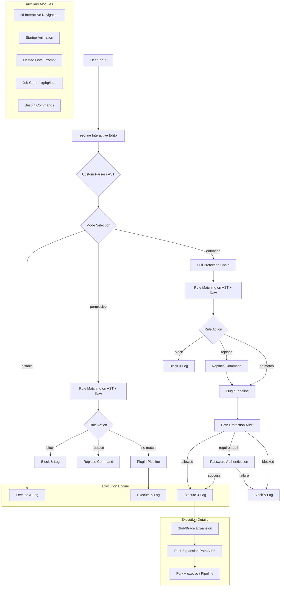
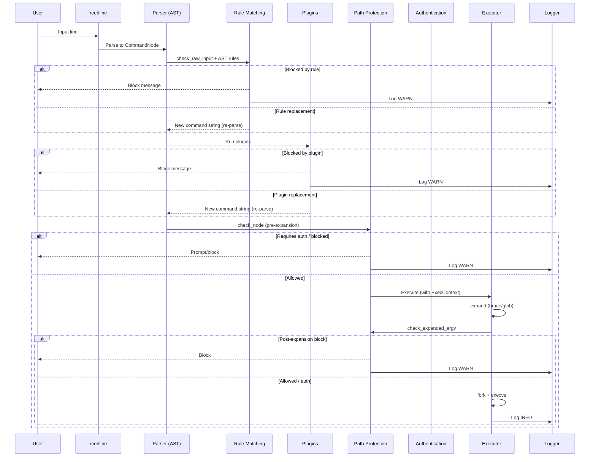

# Deeprotection (dpshell) Architecture Document

## 1. Overview

Deeprotection (`dpshell`) is a fully‑fledged interactive shell with integrated security enforcement. It parses and executes commands natively – no `/bin/sh` wrapper – and adds layers of rule‑based matching, plugin extensibility, path protection, audit logging, and password authentication. The architecture is modular, configuration‑driven, and designed for clarity and security.

## 2. High‑Level Architecture Diagram


```mermaid
graph TD
    A[User Input] --> B[reedline Interactive Editor]
    B --> C{Custom Parser / AST}
    C --> D{Mode Selection}
    D -->|disable| E[Execute & Log]
    D -->|permissive| F[Rule Matching on AST + Raw]
    D -->|enforcing| G[Full Protection Chain]

    F --> H{Rule Action}
    H -->|block| I[Block & Log]
    H -->|replace| J[Replace Command]
    H -->|no match| K[Plugin Pipeline]
    K --> L[Execute & Log]

    G --> M[Rule Matching on AST + Raw]
    M --> N{Rule Action}
    N -->|block| O[Block & Log]
    N -->|replace| P[Replace Command]
    N -->|no match| Q[Plugin Pipeline]
    P --> Q
    Q --> R[Path Protection Audit]
    R -->|allowed| S[Execute & Log]
    R -->|requires auth| T[Password Authentication]
    T -->|success| S
    T -->|failure| U[Block & Log]
    R -->|blocked| U

    subgraph Execution Engine
        E
        L
        S
    end

    subgraph Execution Details
        V[Glob/Brace Expansion]
        W[Post‑Expansion Path Audit]
        X[Fork + execve / Pipeline]
    end

    S --> V --> W --> X

    subgraph Auxiliary Modules
        Y[cd Interactive Navigation]
        Z[Startup Animation]
        AA[Nested Level Prompt]
        AB[Job Control fg/bg/jobs]
        AC[Built‑in Commands]
    end
```

## 3. Core Module Descriptions

### 3.1 Mode Selection & Dispatching

- **Responsibility**: Decides the command processing flow based on `core.mode` in `/etc/deeprotection/config.toml`.
- **Three Modes**:
  - `disable`: Execute unconditionally; only logging (no rules, plugins, path protection).
  - `permissive`: Apply rules, then run plugins; **no path protection**.
  - `enforcing`: Full chain → rules → plugins → path protection (with password authentication when required). Additionally a **post‑expansion audit** catches expanded glob results.
- **Implementation**: Branching in `main.rs` REPL.

### 3.2 Rule Matching Module

- **Configuration Source**: `[[rules]]` TOML array.
- **Rule Compilation**: At startup, enabled rules are compiled into `CompiledRule` objects supporting multiple matchers:
  - **Plain string** → auto‑converted to anchored regex with flexible whitespace (e.g. `"rm -rf"` → `^\s*rm\s+-rf\s*$`).
  - **Explicit regex** (`re:...` prefix) → compiled as‑is.
  - **Command name** (`cmd:...` prefix) → matches if the command basename equals the given name.
  - **Argument regex** (`arg:...` prefix) → matches if any argument matches the regex.
- **Actions**: `block` (reject command) or `replace` (substitute with another command string).
- **Matching Flow**:
  1. `check_raw_input` runs first (before AST parsing) against raw‑input rules – catches structural patterns such as fork bombs.
  2. `apply_rules_to_node` walks the AST, testing each `SimpleCommand` leaf; a pipeline stage is only replaced if the replacement itself is a simple command.
  3. **First match wins** – evaluation stops at the first rule that fires.

### 3.3 Path Protection Module (Enforcing Mode Only)

- **Configuration Keys**:
  - `[paths] protect`: list of absolute directory prefixes treated as protected.
  - `[paths] allowlist`: list of command basenames (e.g. `"rm"`) permitted to touch protected paths, subject to authentication.
- **Audit Stages**:
  1. **Pre‑execution (AST‑level)**: `check_node` walks all `SimpleCommand` leaves, resolves argument paths (including `--option=value` and `key=value` forms like `dd of=...`), and checks against protected prefixes.
  2. **Post‑expansion**: After glob/brace expansion, `check_expanded_argv` re‑checks the concrete expanded arguments. If a glob followed a symlink to a protected directory, this catches it.
- **Path Resolution**: `resolve_arg` canonicalises the longest existing ancestor to neutralise `..` and symlink traversal, then re‑attaches the non‑existent tail. If cwd cannot be determined, enforcement fails closed (blocks the command).
- **Policy**:
  - No protected path touched → `Allowed`.
  - Protected path touched:
    - Command in `allowlist` → `RequiresAuth` (password prompt).
    - Command NOT in `allowlist` → `Blocked`.
- **Authentication**: Up to 3 attempts; SHA‑256 checked against `[auth].password_hash`.

### 3.4 Plugin System

- **Directory**: `/etc/deeprotection/plugins/*/plugin.json`.
- **Invocation**:
  - Command passed via **stdin** and env var `DPSHELL_COMMAND`.
  - Exit codes: `0` = allow; `1` = block; `2` = replace (stdout gives new command).
  - Timeout: 5 seconds; on timeout the child is killed and the original command is allowed (fail‑open).
- **Order**: Plugins run synchronously in directory‑scan order; each can transform the command.

### 3.5 Logging Module

- **Format**: JSON Lines (one JSON object per line).
- **File**: `/var/log/audit.log` (append‑only, auto‑created).
- **Fields**: `timestamp`, `level`, `user`, `mode`, `command`, `working_dir`, `pid`, `exit_code`, `message`.
- **Thread safety**: `Mutex<LineWriter<File>>`; flushed after each command.

### 3.6 Interactive `cd` Navigation

- `cd ?` – non‑hidden subdirectories list, select by number.
- `cd ??` – recursive browser (`l` = up, `q` = quit).
- Handled entirely in `cd.rs`; English strings hardcoded.

### 3.7 Auxiliary Features

- **Startup Animation**: `"dpshell>"` slides across the terminal.
- **Nested Level Prompt**: `DPSHELL_LEVEL` env var; prompt shows `dpshell(level)$ ` (or `#` for root).
- **Command History**: Stored in `/tmp/dpshell_history.<random hex>` (reedline‑managed, survives sessions).
- **Fish‑style interactive features** (togglable via `[features]`):
  - Syntax highlighting
  - Grey‑text autosuggestions from history
  - Fuzzy tab completion (command names, file paths)
- **Job Control**: Built‑in `fg`, `bg`, `jobs` with full POSIX process‑group management.
- **Shell Functions**: `name() { body }` syntax, stored in a function table.
- **Glob & Brace Expansion**: Handled in the parent before fork, protected by an argument count limit.

## 4. Configuration File Format (TOML)

**Path**: `/etc/deeprotection/config.toml`

```toml
[core]
mode = "enforcing"                  # disable | permissive | enforcing

[features]
syntax_highlighting = false
auto_suggest        = false
tab_completion      = false

[auth]
# SHA-256 hex digest (generate: echo -n "pass" | sha256sum)
password_hash = "..."

[paths]
protect = ["/root/test", "/root/.ssh"]
allowlist = ["rm", "rmdir", "mv", "cp", "chmod", "chown", "touch", "cat", "ls"]

[features]
syntax_highlighting = true          # default true
auto_suggest        = true          # default true
tab_completion      = true          # default true

[[rules]]
name = "block_rm_rf"
pattern = "rm -rf"
action = { block = true }
enabled = true

[[rules]]
name = "replace_echo"
pattern = "re:^echo 111$"
action = { replace = "echo 222" }
enabled = true
```

- All sections except `[core]` are optional; `[features]` defaults to all enabled.
- Rule `pattern` can be plain, `re:`, `cmd:`, or `arg:`.
- An empty `allowlist` blocks all commands from touching protected paths.

## 5. Log Output Example

```json
{"timestamp":"2025-04-13T10:30:22Z","level":"WARN","user":"alice","mode":"enforcing","command":"rm /etc/passwd","working_dir":"/home/alice","pid":1234,"exit_code":0,"message":"blocked: command not in allowlist (final: rm /etc/passwd)"}
{"timestamp":"2025-04-13T10:32:05Z","level":"INFO","user":"alice","mode":"permissive","command":"echo 111","working_dir":"/home/alice","pid":1235,"exit_code":0,"message":"replaced to: echo 222"}
```

## 6. Core Flow Sequence Diagram (Enforcing Mode)


```mermaid
sequenceDiagram
    participant U as User
    participant R as reedline
    participant P as Parser (AST)
    participant RM as Rule Matching
    participant PL as Plugins
    participant PP as Path Protection
    participant A as Authentication
    participant E as Executor
    participant L as Logger

    U->>R: Input line
    R->>P: Parse to CommandNode
    P->>RM: check_raw_input + AST rules
    alt Blocked by rule
        RM-->>U: Block message
        RM->>L: Log WARN
    else Rule replacement
        RM-->>P: New command string (re‑parse)
    end
    P->>PL: Run plugins
    alt Blocked by plugin
        PL-->>U: Block message
        PL->>L: Log WARN
    else Plugin replacement
        PL-->>P: New command string (re‑parse)
    end
    P->>PP: check_node (pre‑expansion)
    alt Requires auth / blocked
        PP-->>U: Prompt/block
        PP->>L: Log WARN
    else Allowed
        PP->>E: Execute (with ExecContext)
        E->>E: expand (brace/glob)
        E->>PP: check_expanded_argv
        alt Post‑expansion block
            PP-->>U: Block
            PP->>L: Log WARN
        else Allowed / auth
            E->>E: fork + execve
            E->>L: Log INFO
        end
    end
```

## 7. Extension Points & Customisation Guide

### 7.1 Adding a New Rule
Edit the `[[rules]]` table – no code changes required.

### 7.2 Adding a New Plugin
Create a directory with `plugin.json` and entrypoint in `/etc/deeprotection/plugins/`.

### 7.3 Modifying Protected Paths or Allowlist
Edit the `[paths]` section; takes effect on next shell start.

### 7.4 Extending Built‑in Commands
Add a handler function in `builtins.rs`, register it in the dispatch table inside `main.rs`.

### 7.5 Customising Interactive Features
Toggle `[features]` flags or replace the highlighter/completer implementations in `interactive.rs`.

## 8. Dependencies (from Cargo.toml)

```toml
[dependencies]
reedline = "0.35"        # modern line editor with highlighting / hints / menus
nucleo = "0.5"           # fuzzy matching for tab completion
regex = "1.10"
anyhow = "1.0"
serde = { version = "1.0", features = ["derive"] }
serde_json = "1.0"
toml = "0.8"
sha2 = "0.10"
rpassword = "7"
nix = { version = "0.29", features = ["process", "signal"] }
glob = "0.3"
libc = "0.2"
chrono = "0.4"
terminal_size = "0.3"
users = "0.11"
shlex = "1"
nu-ansi-term = "0.50"
```

---

*Document Version: 2.1*  
*Last Updated: 2026‑05‑08*  
*For the Refactored Deeprotection (dpshell)*